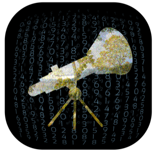
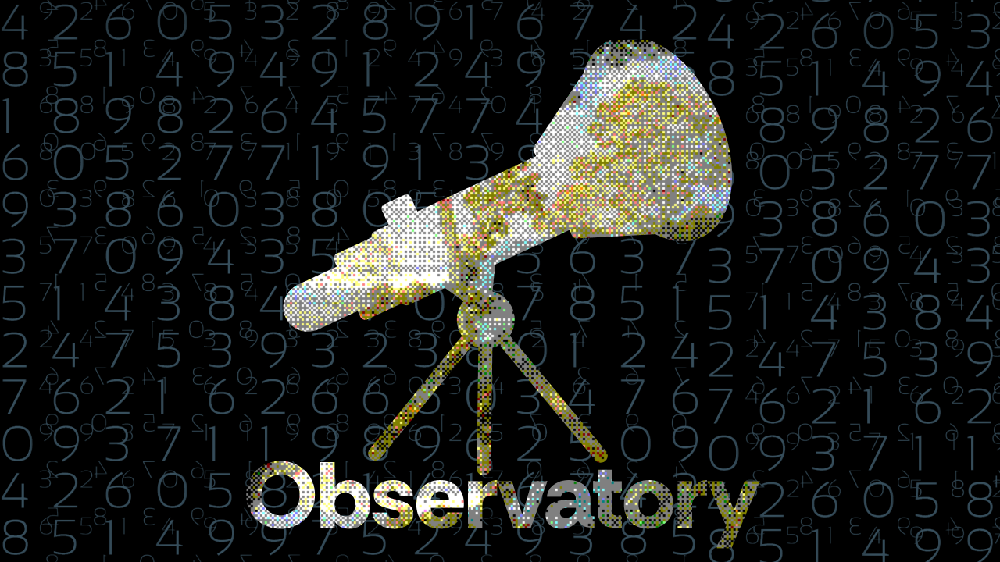

# Observatory



Observatory — activity monitor, but more. Created for developers and power
users who expect more than a long list of processes.

1. groups related processes into understandable application totals, with CPU,
   memory, disk activity, wakeups, process count, and state in one place.
2. records controlled usage tests for one to four applications at once, with
   manual and automatic test modes, optional warm-up, and repeated rounds.
3. stores test results for you to inspect later and compare with results from
   any other saved test.

Available only on macOS.

Observatory is local-first. All recorded data stays on your device. The live
**Now** view keeps only a rolling 60-second chart in memory; persistent
recording begins only when you start a test.



## Download

Download the latest build from
[GitHub Releases](https://github.com/KidPudel/Observatory/releases/latest).

The current GitHub build is ad-hoc signed rather than notarized. Read the
[installation guide](docs/installation.md) to verify the download and open it
for the first time without disabling Gatekeeper.

## Requirements

- macOS 14 or later
- Apple silicon for the currently tested release path
- Xcode 26 or later when building from source

Some protected or short-lived processes may have unavailable measurements.
Observatory shows them as unavailable instead of silently treating them as
zero. See [known limitations](docs/known-limitations.md) for details.

## Build and run

From the repository root:

```sh
./scripts/run.sh
```

This resolves the pinned dependencies, builds the Debug configuration into
`.build`, and opens `Observatory.app`. Xcode is optional unless you need its
debugger, previews, or another IDE-only tool.

To produce an ad-hoc-signed release candidate, its ZIP archive, and a SHA-256
checksum:

```sh
./scripts/release.sh
```

The release artifacts are written to `.release/`.

## Release information

- [Privacy disclosure](docs/privacy.md)
- [Installation guide](docs/installation.md)
- [Known limitations](docs/known-limitations.md)
- [Release checklist](docs/release-checklist.md)
